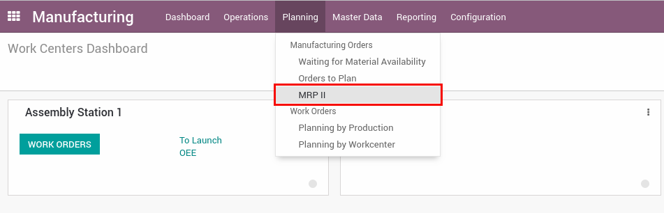
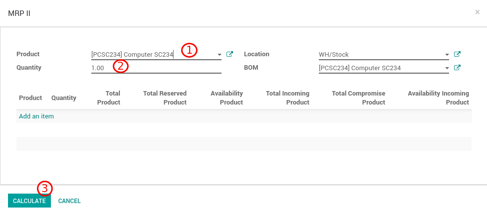
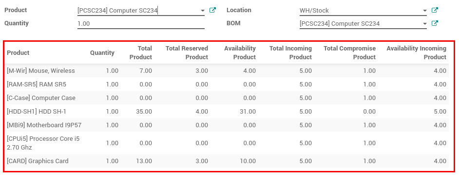
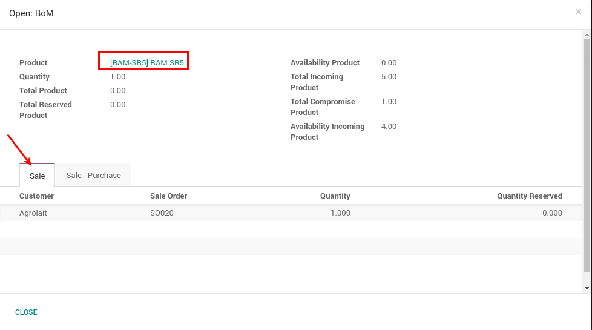
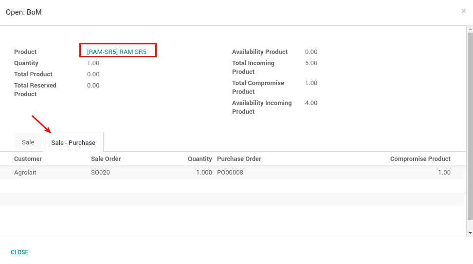
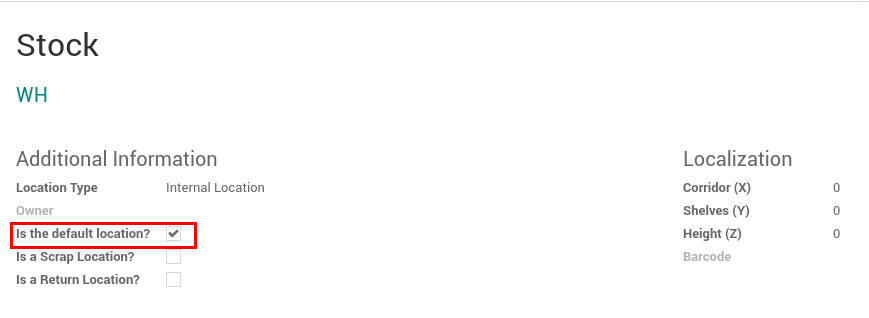

MRP II
======

This module allows to know the real stock of materials (from the bill of materials) to sell a product.

Usage
=====

- Go to **Production> Planning> MRP II**

|

1. It must select the product to be sold, by default the bill of materials of the selected product is associated.
2. The amount of the product to be sold must be indicated.
3. The location of the stock is the default location. (*)
4. Press the **Calculate** button.

|

The following is shown for each material in the bill of materials:

- Quantity (necessary to manufacture the selected product).
- Total products (physical quantity of each material).
- Total reserved products (reserved quantity of each material).
- Available products (Total products - Total products reserved).
- Total incoming products (materials in transit).
- Total committed products.
- Incoming products available (Total incoming products - Total products committed).

|

For each material, the sales and purchase information associated with said material are shown:

|

|

(*)
The default location must have the field **is default location?** checked.

|

Credits
=======

Contributors
------------
* Leandro Pacheco <leandro@vauxoo.com>
* José Morales <jose@vauxoo.com>
* Edilianny Sánchez <esanchez@vauxoo.com>
* Germana Oliveira <germana@vauxoo.com>

Do not contact contributors directly about support or help with technical issues.

Maintainer
----------

.. image:: https://s3.amazonaws.com/s3.vauxoo.com/description_logo.png
   :alt: Vauxoo
   :target: https://vauxoo.com
