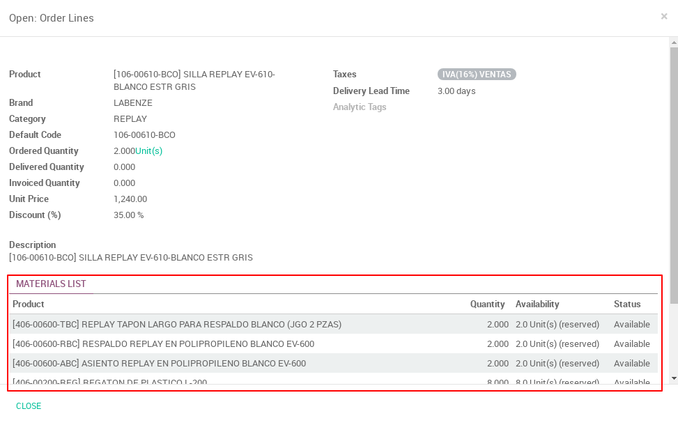

Product Compromise
==================

This module allows to reserve, liberate and compromise raw materials for each
product of a sale order.

In a sale order select the product you want to manage in the sale order lines,
you will see the information about thet product and the raw materials list in
the bottom:

|

|

Now select one of the raw materials and it will display a form that lets you
`COMPROMISE`, `LIBERATE`, and `RESERVE` the quantities needed of that raw material
for that sale order:

|

.. figure:: ../product_compromise/static/src/img/product_Compromise_wizard.png
   :align: center
   :width: 600pt

