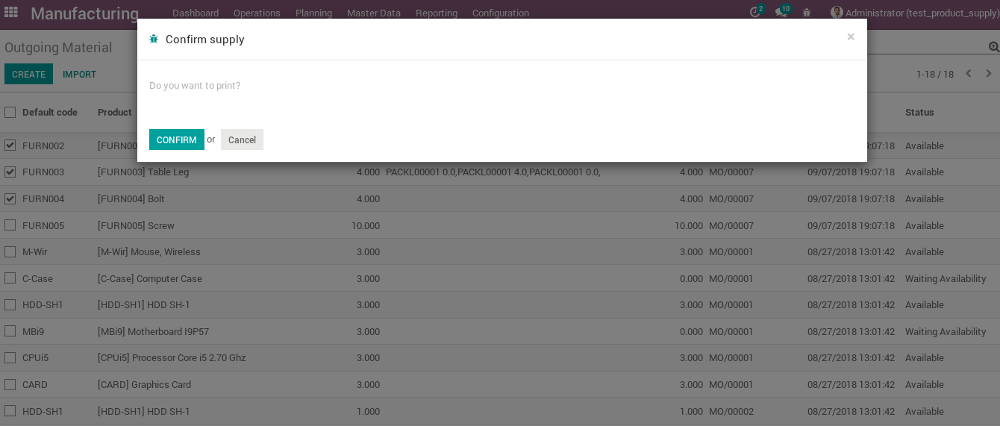

Product Supply
==============

This module allows to generate a report of all the products in productión, to
do this you have two menu options available in `Manufacturing > Planning > Manufacturing Ordes`:

* Outgoing Material
* Outgoing Material for Tomorow

Once the report is displayed select the orders you want to confirm and go to
`Action` menu and select `Confirm supply`:

|

|

If you are sure select `Confirm` and the report will be printed.
