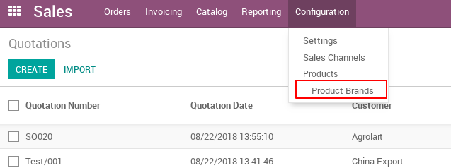
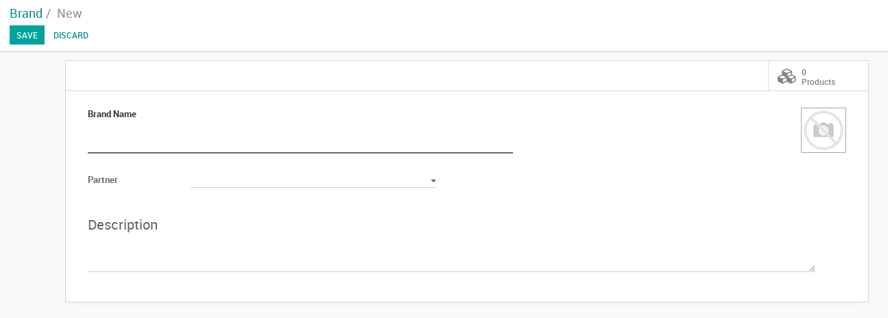
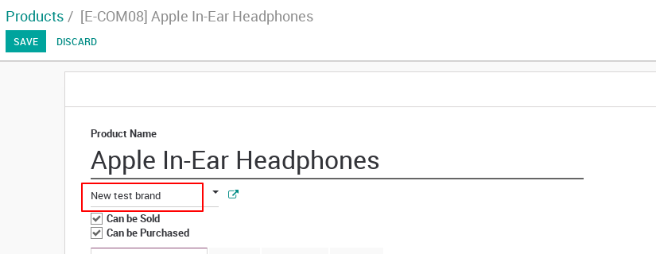
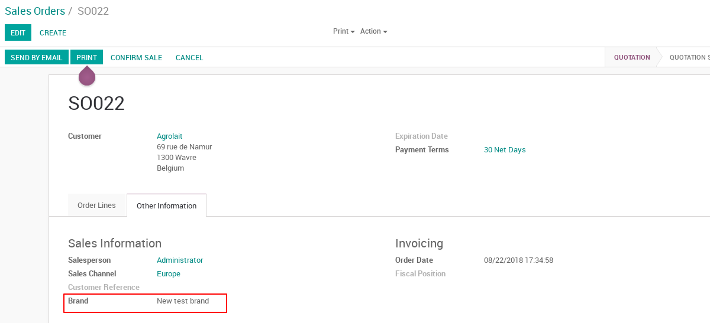
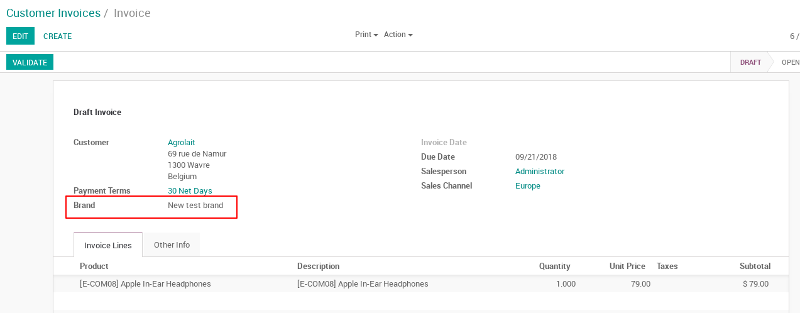

Sale Brand
==========

This module allows to assign a brand to each product and automatically set it
on a sale order and an invoice.

Create a Brand
--------------

To create a new brand or edit one already created go to `Sales > Configuration`
and select the `Product Brands` option.

|

|

And create a brand:

|

|

Then go to Products and set a brand to every product:

|

|

Now from quotations to invoice you will see a `Brand` field which will be
computed and display the product brand (if exists).

Quotations and Sale Orders
--------------------------

You will see the `Brand` field in `Other Info` tab on quotations and sale orders
and it will display the brand of the product selected once the quotation or
sale order is saved. It is important to have in mind that the orders should
place only products from the same brand.

|

|

Invoices
--------

You will see the `Brand` field in the top of the invoice and it will display 
the brand of the product selected once the invoice is saved. It is important to
have in mind that the orders should place only products from the same brand.

|

